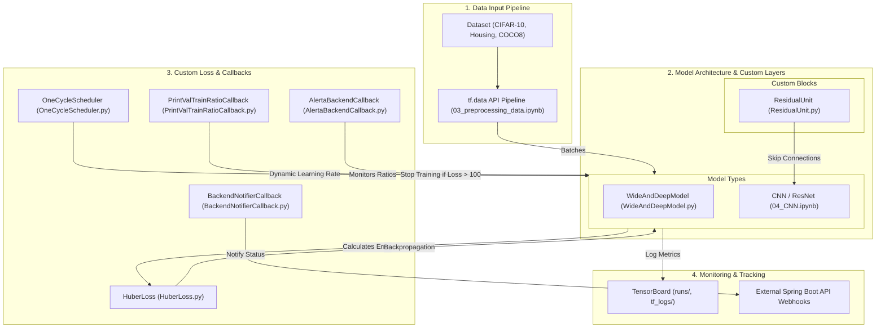

# 🧠 Deep Learning & Neural Networks Roadmap

[](https://www.python.org/)
[](https://www.tensorflow.org/)
[](https://keras.io/)
[](https://github.com/ultralytics/ultralytics)

Welcome to the ultimate **Deep Learning Roadmap** repository. This project is a curated, hands-on path designed to take you from basic tensor operations to production-ready Deep Learning models, custom neural network architectures, and MLOps pipelines. 

---

## 🎨 System Architecture & Data Flow

This repository contains not just tutorial notebooks, but a fully functional ecosystem of custom layers, loss functions, callbacks, and models. The following diagram illustrates how these components interact during a model's lifecycle:



---

## 📂 Project Directory Map

Below is a detailed overview of the folder hierarchy and files inside this workspace.

| Component / Path | Type | Description | Key Features / Classes |
| :--- | :---: | :--- | :--- |
| 📁 [notebooks/](file:///c:/Users/User/Music/deep_learning_projects/notebooks) | Directory | Central container for all learning resources and code modules. | Organized by sequence |
| ├── 📓 [01_tensorflow.ipynb](file:///c:/Users/User/Music/deep_learning_projects/notebooks/01_tensorflow.ipynb) | Notebook | Fundamental tensor operations and mathematical execution graphs. | Constants, Variables, Gradients |
| ├── 📓 [01_tensorflow-2.0.ipynb](file:///c:/Users/User/Music/deep_learning_projects/notebooks/01_tensorflow-2.0.ipynb) | Notebook | Modern Keras integration and Eager Execution. | TF 2.0 API conventions |
| ├── 📓 [02_deeplearning.ipynb](file:///c:/Users/User/Music/deep_learning_projects/notebooks/02_deeplearning.ipynb) | Notebook | Building, training, and customizing Dense Feedforward Neural Networks. | Sequential & Functional APIs |
| ├── 📓 [03_preprocessing_data.ipynb](file:///c:/Users/User/Music/deep_learning_projects/notebooks/03_preprocessing_data.ipynb) | Notebook | High-performance ETL pipeline processing. | `tf.data.Dataset`, Prefetching |
| ├── 📓 [04_CNN.ipynb](file:///c:/Users/User/Music/deep_learning_projects/notebooks/04_CNN.ipynb) | Notebook | Convolutional networks, ResNets, and object detection with YOLOv8. | Conv2D, Pooling, YOLO Trainer |
| ├── 📓 [04_cifar10.ipynb](file:///c:/Users/User/Music/deep_learning_projects/notebooks/04_cifar10.ipynb) | Notebook | Benchmark image classification using CNNs and custom schedulers. | CIFAR-10 training loops |
| ├── 📓 [05_RNN.ipynb](file:///c:/Users/User/Music/deep_learning_projects/notebooks/05_RNN.ipynb) | Notebook | Sequential time-series and natural language processing. | SimpleRNN, LSTM, GRU |
| ├── 📓 [05_encoder-decoder.ipynb](file:///c:/Users/User/Music/deep_learning_projects/notebooks/05_encoder-decoder.ipynb) | Notebook | Sequence-to-sequence networks, attention mechanisms, and translation. | Encoder-Decoder architecture |
| ├── 📓 [06_GANs.ipynb](file:///c:/Users/User/Music/deep_learning_projects/notebooks/06_GANs.ipynb) | Notebook | Generative Adversarial Networks (GANs) for generating synthetic data. | Custom training loops, tape gradients |
| ├── 📓 [07_Mlops.ipynb](file:///c:/Users/User/Music/deep_learning_projects/notebooks/07_Mlops.ipynb) | Notebook | Model versioning, logging metrics, and loading weights. | EarlyStopping, Checkpoints |
| ├── 📄 [WideAndDeepModel.py](file:///c:/Users/User/Music/deep_learning_projects/notebooks/WideAndDeepModel.py) | Python Module | Multi-input, multi-output model using Keras Subclassing. | `WideAndDeepModel` |
| ├── 📁 [Layers/](file:///c:/Users/User/Music/deep_learning_projects/notebooks/Layers) | Package | Custom structural layers. | Reusable neural components |
| │   └── 📄 [ResidualUnit.py](file:///c:/Users/User/Music/deep_learning_projects/notebooks/Layers/ResidualUnit.py) | Python Module | Skip connection block with batch normalization. | `ResidualUnit` |
| ├── 📁 [callbacks/](file:///c:/Users/User/Music/deep_learning_projects/notebooks/callbacks) | Package | Custom event-driven hooks executed during model training. | Monitoring & scheduling |
| │   ├── 📄 [AlertaBackendCallback.py](file:///c:/Users/User/Music/deep_learning_projects/notebooks/callbacks/AlertaBackendCallback.py) | Python Module | Mathematical anomaly detection and training self-halt. | `AlertaBackendCallback` |
| │   ├── 📄 [BackendNotifierCallback.py](file:///c:/Users/User/Music/deep_learning_projects/notebooks/callbacks/BackendNotifierCallback.py) | Python Module | Real-time REST API notifications for training progress. | `BackendNotifierCallback` |
| │   ├── 📄 [OneCycleScheduler.py](file:///c:/Users/User/Music/deep_learning_projects/notebooks/callbacks/OneCycleScheduler.py) | Python Module | Custom 1-Cycle Learning Rate Policy. | `OneCycleScheduler` |
| │   └── 📄 [PrintValTrainRatioCallback.py](file:///c:/Users/User/Music/deep_learning_projects/notebooks/callbacks/PrintValTrainRatioCallback.py) | Python Module | Validation/training loss ratio printouts. | `PrintValTrainRatioCallback` |
| └── 📁 [utils/](file:///c:/Users/User/Music/deep_learning_projects/notebooks/utils) | Package | Loss functions and logger utilities. | Mathematical operations |
|     ├── 📄 [HuberLoss.py](file:///c:/Users/User/Music/deep_learning_projects/notebooks/utils/HuberLoss.py) | Python Module | Robust error function resistant to outliers. | `HuberLoss` |
|     └── 📄 [run_lodgir.py](file:///c:/Users/User/Music/deep_learning_projects/notebooks/utils/run_lodgir.py) | Python Module | Launch and utility loader script. | Log parsing |

---

## 📖 Deep Learning Phases Detail

### 📦 Phase 1: TensorFlow Foundations
Explore the core data structure of Deep Learning: the tensor. Learn how TensorFlow executes operations under-the-hood and how automatic differentiation works.
- **Topics**: Constant tensors, Variable tensors, tensor shapes, slicing, matrix multiplication, custom gradients using `tf.GradientTape`, and compiling computational graphs with `@tf.function`.
- **Reference**: [01_tensorflow.ipynb](file:///c:/Users/User/Music/deep_learning_projects/notebooks/01_tensorflow.ipynb) and [01_tensorflow-2.0.ipynb](file:///c:/Users/User/Music/deep_learning_projects/notebooks/01_tensorflow-2.0.ipynb).

### 🧬 Phase 2: Feedforward Networks & Customization
Learn how to build neural architectures that fit tabular and custom tasks. Understand the three API levels of Keras (Sequential, Functional, and Subclassing).
- **Topics**: Multi-Layer Perceptrons (MLPs), activation functions (ReLU, Sigmoid, Softmax), hyperparameter tuning, and custom model architectures.
- **Reference**: [02_deeplearning.ipynb](file:///c:/Users/User/Music/deep_learning_projects/notebooks/02_deeplearning.ipynb) and [WideAndDeepModel.py](file:///c:/Users/User/Music/deep_learning_projects/notebooks/WideAndDeepModel.py).

### 📊 Phase 3: High-Performance Data Input
Raw data is often the bottleneck in GPU-accelerated deep learning. Master how to load, stream, and transform large datasets efficiently.
- **Topics**: The `tf.data` API, parallel data reading (`interleave`), batching, caching, `prefetch` strategies, TFRecord parsing, and dataset mapping.
- **Reference**: [03_preprocessing_data.ipynb](file:///c:/Users/User/Music/deep_learning_projects/notebooks/03_preprocessing_data.ipynb).

### 👁️ Phase 4: Computer Vision (CNNs & ResNets)
Understand how convolution operations extract hierarchical features from images, and implement state-of-the-art vision models.
- **Topics**: Convolutional layers, strides, padding, pooling, batch normalization, residual skipping connections, and deploying YOLOv8 for real-time object detection.
- **Reference**: [04_CNN.ipynb](file:///c:/Users/User/Music/deep_learning_projects/notebooks/04_CNN.ipynb) and [04_cifar10.ipynb](file:///c:/Users/User/Music/deep_learning_projects/notebooks/04_cifar10.ipynb).

### 💬 Phase 5: Sequence Modeling (RNNs & Seq2Seq)
Process temporal or language-based sequential data where context is crucial.
- **Topics**: Simple Recurrent Neural Networks (RNNs), Long Short-Term Memory (LSTM) cells, Gated Recurrent Units (GRUs), Encoder-Decoder translation models, and attention.
- **Reference**: [05_RNN.ipynb](file:///c:/Users/User/Music/deep_learning_projects/notebooks/05_RNN.ipynb) and [05_encoder-decoder.ipynb](file:///c:/Users/User/Music/deep_learning_projects/notebooks/05_encoder-decoder.ipynb).

### 🎨 Phase 6: Generative Models (GANs)
Learn the theory of minimax games between a Generator and a Discriminator.
- **Topics**: Custom training loops using `GradientTape` to update two models simultaneously, transposed convolutions (fractionally-strided), and stable DCGAN training configurations.
- **Reference**: [06_GANs.ipynb](file:///c:/Users/User/Music/deep_learning_projects/notebooks/06_GANs.ipynb).

### 🛠️ Phase 7: MLOps & Experiment Tracking
Track training execution, export serialization, and build pipelines that are ready for production deployment.
- **Topics**: TensorBoard dashboard setups, early stopping triggers, callbacks, checkpoint storage, and format conversion (`.keras` vs `.h5`).
- **Reference**: [07_Mlops.ipynb](file:///c:/Users/User/Music/deep_learning_projects/notebooks/07_Mlops.ipynb).

---

## 🏗️ Deep Dive: Custom Architecture & Patterns

### 1. Custom Structural Layer: ResNet Block
The [ResidualUnit](file:///c:/Users/User/Music/deep_learning_projects/notebooks/Layers/ResidualUnit.py) subclass compiles a custom layer with a skip connection:
```python
# Usage Example in a model:
from Layers.ResidualUnit import ResidualUnit
model = keras.Sequential([
    keras.layers.Conv2D(64, 7, activation="relu", padding="same", input_shape=[32, 32, 3]),
    ResidualUnit(filters=64, strides=1),
    ResidualUnit(filters=64, strides=1),
    # ...
])
```
It computes:
$$\text{Output} = \text{Activation}(\text{Conv}_2(\text{BatchNorm}_2(\text{Activation}(\text{Conv}_1(\text{BatchNorm}_1(\mathbf{x})))) + \text{Skip}(\mathbf{x}))$$
If strides > 1, the skip connection applies an identical 1x1 Convolution to match spatial dimensions.

### 2. Custom Robust Loss: Huber Loss
The [HuberLoss](file:///c:/Users/User/Music/deep_learning_projects/notebooks/utils/HuberLoss.py) class implements an error metric robust to outliers:
```python
# Compile model with Huber Loss
from utils.HuberLoss import HuberLoss
model.compile(optimizer="adam", loss=HuberLoss(threshold=1.5))
```
Mathematically, the loss is defined as:
$$L_{\delta}(y, \hat{y}) = \begin{cases} \frac{1}{2}(y - \hat{y})^2 & \text{for } |y - \hat{y}| \le \delta \\ \delta(|y - \hat{y}| - \frac{1}{2}\delta) & \text{otherwise} \end{cases}$$
This prevents exploding gradients during training in the presence of corrupted or noisy target outliers.

### 3. Custom Callback: 1-Cycle Learning Rate Policy
The [OneCycleScheduler](file:///c:/Users/User/Music/deep_learning_projects/notebooks/callbacks/OneCycleScheduler.py) implements Leslie Smith's fast training strategy:
- **Phase 1 (Warmup)**: Ramps up the learning rate from a base `start_rate` to a `max_rate` during the first half of training.
- **Phase 2 (Cooldown)**: Decays the learning rate back to `start_rate` during the second half.
- **Phase 3 (Decay)**: Performs a final land-off decay down to a tiny `last_rate` (e.g., $10^{-3} \times \text{start\_rate}$) to fine-tune weights.

```python
# Injecting the scheduler into model fitting:
from callbacks.OneCycleScheduler import OneCycleScheduler
onecycle_cb = OneCycleScheduler(iterations=10000, max_rate=0.01)
model.fit(X_train, y_train, epochs=25, callbacks=[onecycle_cb])
```

---

## ⚙️ Development Environment Setup

This project requires a Python environment configured for deep learning and GPU/CPU computation.

### 1. Requirements Check
Make sure you have `Python 3.10+` installed on your machine.

### 2. Quick Setup Commands
Run the following steps in your terminal to initialize:

```bash
# Clone the repository
git clone git@github.com:marco-torres-ai/deep_learning_roadmap.git
cd deep_learning_roadmap

# Create virtual environment
python -m venv .venv

# Activate virtual environment
# Windows (PowerShell):
.venv\Scripts\Activate.ps1
# Linux/macOS:
source .venv/bin/activate

# Upgrade pip package manager
python -m pip install --upgrade pip

# Install dependencies (Scientific, Deep Learning, CV and MLOps tools)
pip install numpy pandas matplotlib scikit-learn requests tensorboard
pip install tensorflow keras torch torchvision torchaudio ultralytics jupyterlab
```

### 3. Running Notebooks
Launch the Jupyter Lab workspace:
```bash
jupyter lab
```

---

## 📈 ML Best Practices Recommended for this Repo

> [!NOTE]
> **Data Pipelines**: Always prefer using the `tf.data` input pipeline (`.cache()`, `.shuffle()`, and `.prefetch(tf.data.AUTOTUNE)`) when loading images or large datasets to avoid bottlenecking your training runtime.

> [!WARNING]
> **Weight Checkpoints**: Ensure you keep model weight checkpoints (`*.h5`, `*.keras`) outside Git tracking. This repository is configured to block massive binary assets automatically via [.gitignore](file:///c:/Users/User/Music/deep_learning_projects/.gitignore).

> [!CAUTION]
> **Gradient Explosion**: If you observe model gradients exploding (NaN loss), ensure you use the `HuberLoss` function or activate gradient clipping during compilation:
> `optimizer = keras.optimizers.Adam(clipvalue=1.0)`
